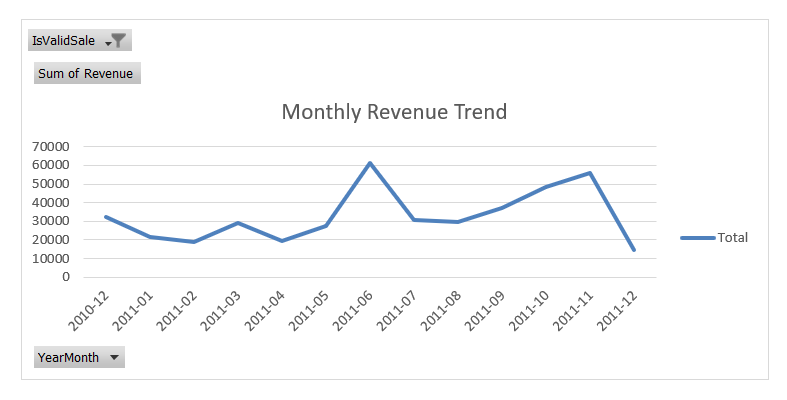
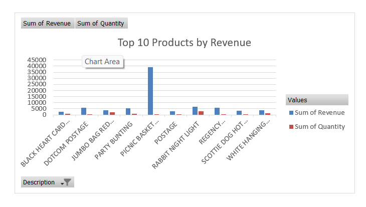
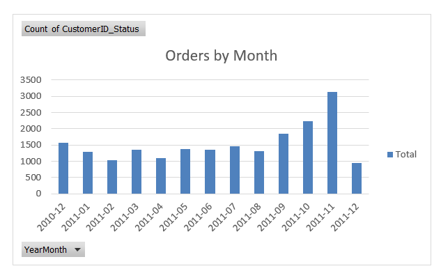

# Excel Data Cleaning & Analysis

## Dataset

Dataset used: `Online_Retail_Cleaned_20K.xlsx`

The Excel phase was used to perform data-quality checks, cleaning, validation, and initial sales analysis.

The cleaned Excel file is included in this project repository.

## Data Quality Decisions

### Cancelled Transactions

Cancelled transactions were identified using the `InvoiceNo` field.

Rows identified as cancelled were excluded from the sales/revenue analysis because they represent cancelled transactions rather than completed sales.

**Cancelled rows identified: 344**

### Zero or Invalid Price

Transactions with zero or invalid `UnitPrice` were excluded from revenue analysis because they do not represent valid positive-value sales.

**Rows excluded: 100**

### Missing CustomerID

Rows with missing `CustomerID` were not automatically removed from the entire dataset.

They were excluded only from analyses that require customer-level identification, such as:

* Customer-level sales analysis
* Customer frequency analysis
* RFM segmentation

This preserves valid transaction-level sales information for other analyses.

**Rows with missing CustomerID: 4,935**

### Duplicate Records

Duplicate records were checked using the relevant transaction fields.

**Duplicate rows identified: 10**

## PivotTable & PivotChart Analysis

The Excel analysis includes six PivotTable-based analyses.

### 1. Monthly Revenue Trend

* Rows: `YearMonth`
* Values: `Sum of Revenue`
* Filter: `IsValidSale = 1`
* Chart: Line chart

### 2. Revenue by Country – Top 10

* Rows: `Country`
* Values: `Sum of Revenue`
* Filter: `IsValidSale = 1`
* Top 10 countries by revenue
* Chart: Horizontal bar chart

.png)

### 3. Top 10 Products by Revenue

* Rows: `Description`
* Values: `Sum of Revenue`, `Sum of Quantity`
* Top 10 products by revenue
* Chart: Bar chart

### 4. Orders by Month

* Rows: `YearMonth`
* Values: `Distinct Count of InvoiceNo`
* Chart: Column chart

### 5. Top 20 Customers by Revenue

* Rows: `CustomerID`
* Values: `Sum of Revenue`, `Distinct Count of InvoiceNo`
* Filter: `CustomerID` not blank
* Filter: `IsValidSale = 1`
* Top 20 customers by revenue

### 6. Executive KPI Summary

The KPI summary is used to validate the main business metrics before moving to SQL analysis.

Key metrics include:

* Total Revenue
* Total Orders
* Total Customers

## Excel Workflow

The Excel analysis followed this process:

1. Data validation
2. Data-quality checks
3. Cleaning and filtering
4. Revenue calculation
5. PivotTable creation
6. PivotChart creation
7. Sales trend analysis
8. KPI validation
9. Preparation of cleaned data for downstream SQL analysis
